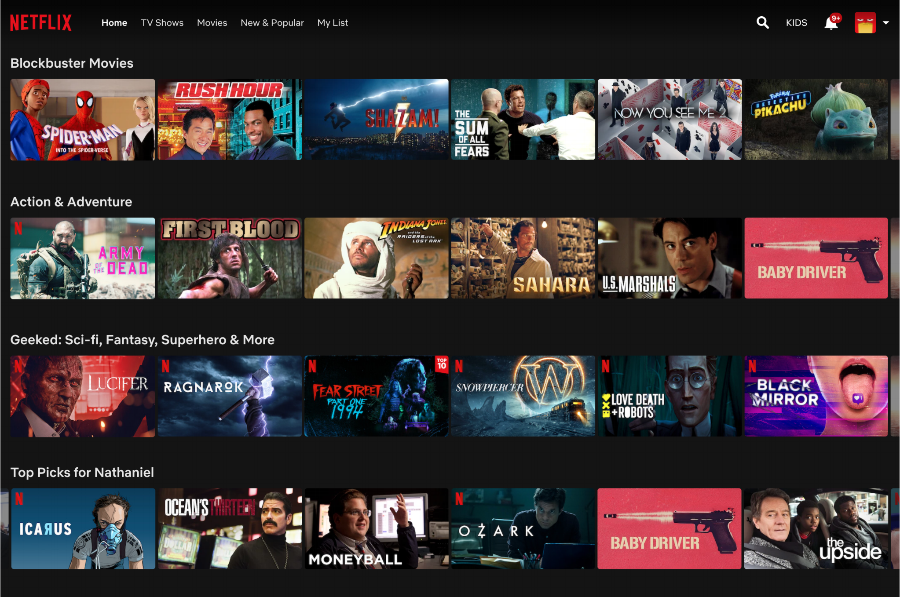

# Implementation 0f A/B Test

When a user goes onto the Netflix homepage, they see different rows of selections of movies
or shows. We wanted to focus in particular on the “Top Picks for. . . ” row that outputs
suggestions curated for the given user. However, a problem for the user may arise called
decision paralysis, where a user is overloaded with too many choices, making it hard for
the user to make a decision. This problem may eventually lead the user to leave the service without watching anything. 

We want to minimize browsing time so that a user can
find their movie or show quickly, lessening the chance of decision paralysis. We found the
optimal condition that will minimize browsing time through a series of data gathering and
experimenting on certain conditions. We reached the lowest browsing time at 10.16 minutes
by setting Tile Size to be 0.2, Preview Type to be teaser/trailer, Match Score to be 75%,
and Preview Length to be 75 seconds.
